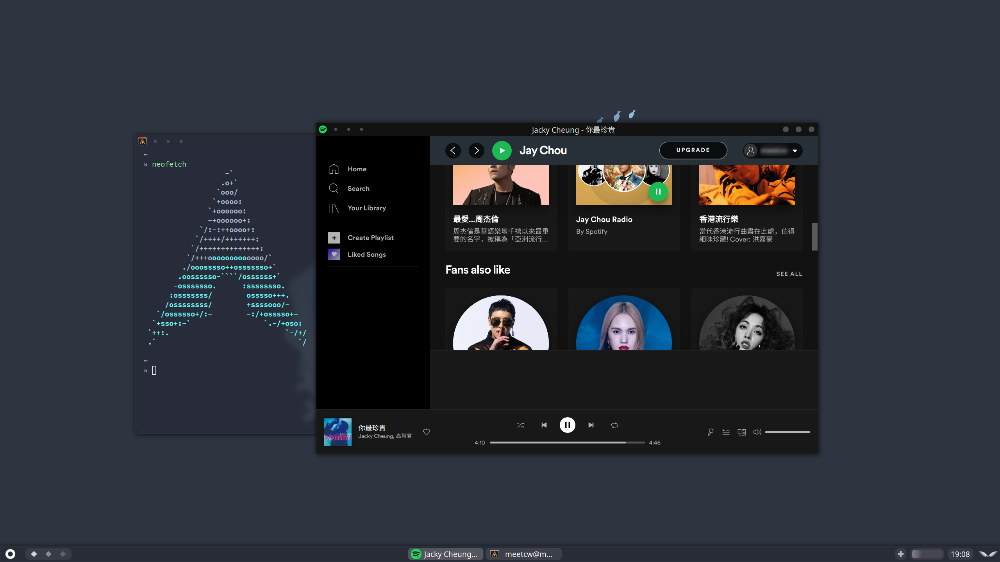

## Install 

| Dependency     | Required | Description           |
| -------------- | -------- | --------------------- |
| material-icons | T        | Top bar icon          |
| alsa-utils     | F        | Volume control widget |

**Arch Linux**

``` shell

pacman -S ttf-material-icons

git clone {repo} ~/.config/awesome

```

Before use,you should replace the software in the `desktop/environment.lua` with your favorite software.

Client keymap in `./desktop/clientkeys.lua`,Global keymap in `./desktop/globalkeys.lua`.

