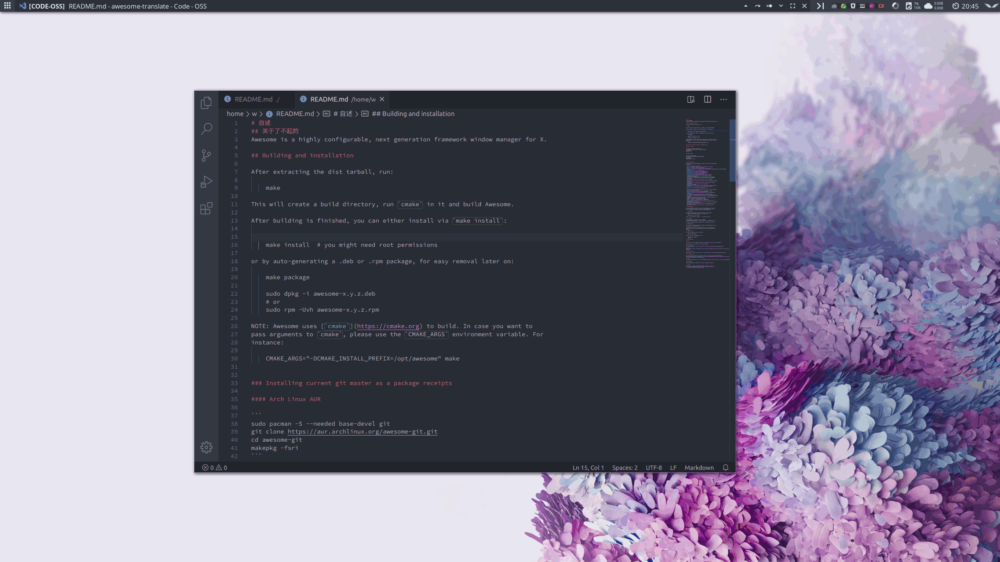
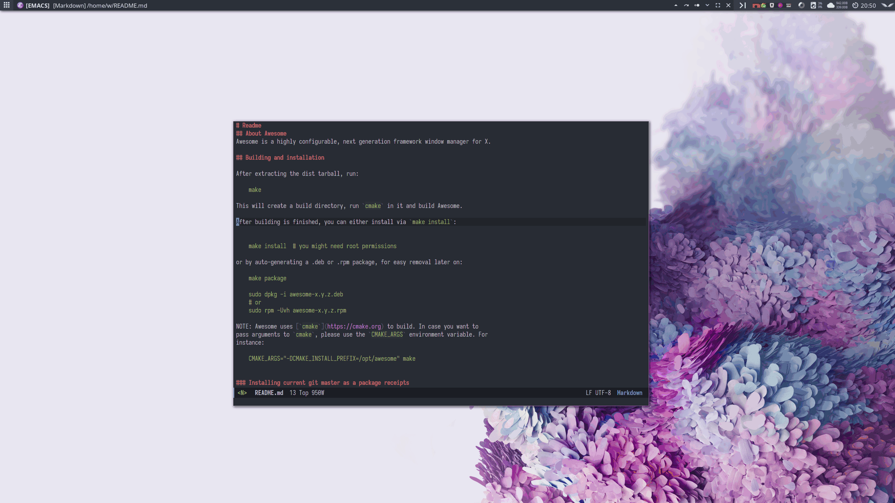

# Awesome translator

Awesome translate 是一个为 Awesome WM 编写的翻译插件，目前支持单词和整句翻译。单词可以通过 Anki-Connect 保存到Anki中。

复制单词释义


保存到Anki


在Emacs中的效果


## 依赖

+ curl
+ xclip
+ rofi(optional)

## 安装&使用


将本项目克隆到Awesome WM的配置目录下

在配置文件中加入如下代码

``` lua
local at = require("path.to.project") --项目路径，用 . 分隔

-- 下面为可选配置

-- 是否使用 rofi 展示单词，false 则使用通知展示
-- at.enable_rofi = false
-- 是否启用 anki
-- at.enable_anki = false
-- Anki保存单词的 Desk
-- at.anki.desk = "Default"
 -- Anki保存单词的 NodeType
-- at.anki.model = "Basic"
-- Anki-Connect 的端口号
-- at.anki.connect_port = 8080
-- 单词字段
-- at.anki.word_field = "world"
-- 释义字段
-- at.anki.definition_field = "definition"
-- 美式音标
-- at.anki.us_pronunciations_field = "us_pronunciations"
-- 英式音标
-- at.anki.uk_pronunciations_field = "uk_pronunciations"
-- Anki保存美式发音的字段
-- at.anki.us_audio_field = "audio"
-- Anki保存英式发音的字段
-- at.anki.uk_audio_field = "audio"

globalkeys =
    gears.table.join(
    globalkeys,
    -- 查询快捷键
    awful.key(
        {keydefine.modkey},
        "q",
        function()
            -- query 的第二个参数表示是否自动复制
            -- at.query(selection(),true)
            at.query(selection())
        end
    ),
     -- 复制快捷键
    awful.key(
        {keydefine.modkey},
        "c",
        function()
            at.copy()
        end
    )
)

```

重新启动 Awesome WM。选中需要翻译的单词或句子，按下快捷键即可。
